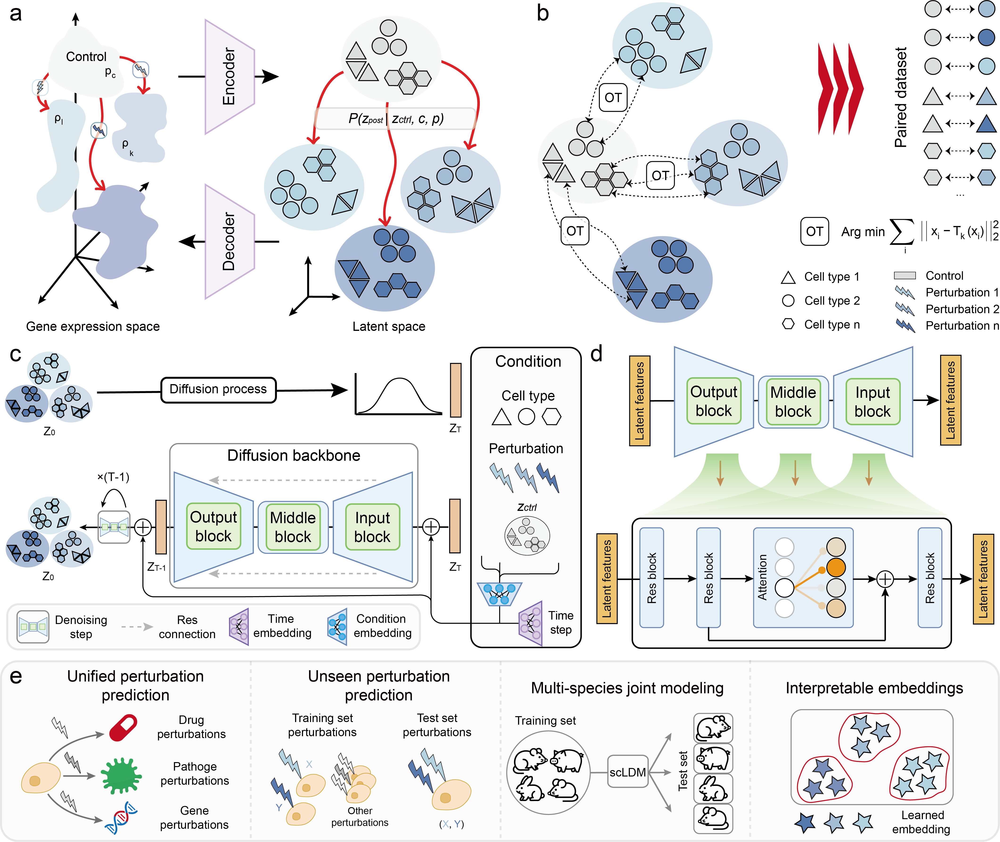

# scLDM
scLDM is a generative framework for predicting single-cell perturbation responses based on a latent diffusion model. By integrating a variational autoencoder (VAE) with a conditional diffusion process, scLDM models pre-perturbation cellular states and perturbation types directly in the latent space, enabling accurate and stable generation of post-perturbation gene expression profiles. Extensive experiments across drug stimulation, viral and bacterial infection, cross-species perturbations, and both single-gene and combinatorial gene perturbations demonstrate that scLDM consistently outperforms existing methods in predictive accuracy and generation quality.

