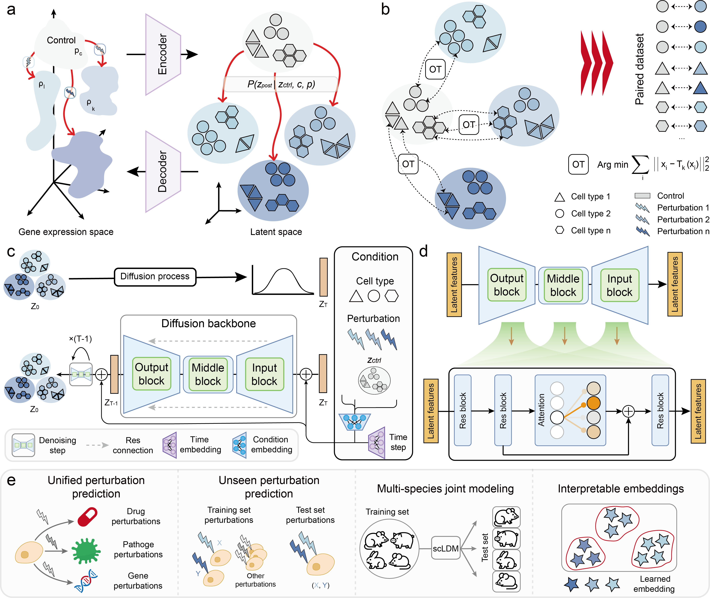

# scLDM — Single-cell Latent Diffusion Model

A latent diffusion framework for predicting single-cell perturbation responses. scLDM couples a VAE that maps gene-expression space into a compact latent with a conditional diffusion backbone that learns the control-to-perturbed distribution shift directly in latent space.



## Overview

Given a control cell $z_{ctrl}$, a cell-type label $c$, and a perturbation token $p$, scLDM models the conditional distribution $P(z_{post} \mid z_{ctrl}, c, p)$ in a pretrained VAE latent (panel **a**). Control and perturbed cells are paired by optimal transport (panel **b**) so the denoising target is well-defined. The diffusion backbone is a U-Net with residual and attention blocks (panels **c**, **d**); conditioning signals (cell type, perturbation, $z_{ctrl}$) are injected through time and condition embeddings at every block.

scLDM targets four downstream tasks (panel **e**):

- **Unified perturbation prediction** across drug, pathogen and gene perturbations
- **Unseen perturbation prediction** — generalize to unseen (X, Y) gene combinations
- **Multi-species joint modeling** in a shared latent
- **Interpretable perturbation embeddings**

## Repository layout

```
scLDM/
├── scLDM/perturbation/             # Python package
│   ├── configs.py
│   ├── diffusion/                  # U-Net backbone, schedulers, samplers
│   │   ├── multimodal_unet.py
│   │   ├── cell_perturbation_datasets.py   # drug / cell-type perturbation loader
│   │   └── gene_perturbation_datasets.py   # gene perturbation loader (gene2vec cond.)
│   └── vae/                        # Autoencoder
├── script/
│   ├── training_vae/               # VAE training entry
│   └── training_diffusion/
│       ├── py_scripts/             # multimodal_train.py, drug_sample.py, gene_sample.py
│       └── ssh_scripts/            # launcher shell scripts (edit paths at top)
├── gene2vec/                       # pretrained gene2vec embeddings (see gene2vec/README.md)
├── docs/                           # figures
├── requirements.txt
└── pyproject.toml
```

## Installation

```bash
git clone <repo-url> scLDM && cd scLDM
pip install -r requirements.txt
pip install -e .
```

Tested with Python ≥ 3.10 and PyTorch 2.2.

## Data preparation

1. Prepare an `.h5ad` file with an `obs` column separating control from perturbed cells:
   - **Drug / cell-type perturbation**: `obs["condition"]` ∈ `{"control", "stimulated"}`
   - **Gene perturbation**: `obs["cp_type"]` ∈ `{"control", "stimulated"}` and `obs["condition"]` gives the perturbed gene — single (`"TP53"`) or combo joined by `_` (`"TP53_MDM2"`)
2. For gene perturbation, drop a pretrained gene2vec text file into [gene2vec/](gene2vec/). See [gene2vec/README.md](gene2vec/README.md) for the expected format and download source.

## Usage

### 1. Train the VAE

```bash
cd script/training_vae
bash train_autoencoder_multimodal.sbatch
```

### 2. Train the diffusion backbone

Edit the path block at the top of [multimodal_train.sh](script/training_diffusion/ssh_scripts/multimodal_train.sh) — `DATA_DIR`, `OUTPUT_DIR`, `ENCODER_CONFIG`, `AE_PATH` — then:

```bash
cd script/training_diffusion
bash ssh_scripts/multimodal_train.sh
```

For gene-perturbation tasks keep `--use_gene_cond True` (default) so the gene2vec branch is enabled; for drug / cell-type perturbation set `--use_gene_cond False`.

### 3. Sample from a trained model

Edit the path block at the top of [multimodal_sample.sh](script/training_diffusion/ssh_scripts/multimodal_sample.sh), pick the appropriate script, then run.

- Drug / cell-type perturbation → [drug_sample.py](script/training_diffusion/py_scripts/drug_sample.py)
- Gene perturbation → [gene_sample.py](script/training_diffusion/py_scripts/gene_sample.py) with `--mode iid` or `--mode ood` (OOD also needs `--ood_data_dir`)

```bash
cd script/training_diffusion
bash ssh_scripts/multimodal_sample.sh
```

Outputs go to `${OUTPUT_DIR}/sample_data_alldata.npz` (IID) or `sample_data.npz` (OOD), each with keys `pert` (predicted latents), `label` (class labels) and `idx` (sample indices). Decode back to gene-expression space with the VAE decoder as needed.

## Citation

If you use scLDM in your research, please cite the corresponding paper.

## License

See `LICENSE` (add one if not present).
